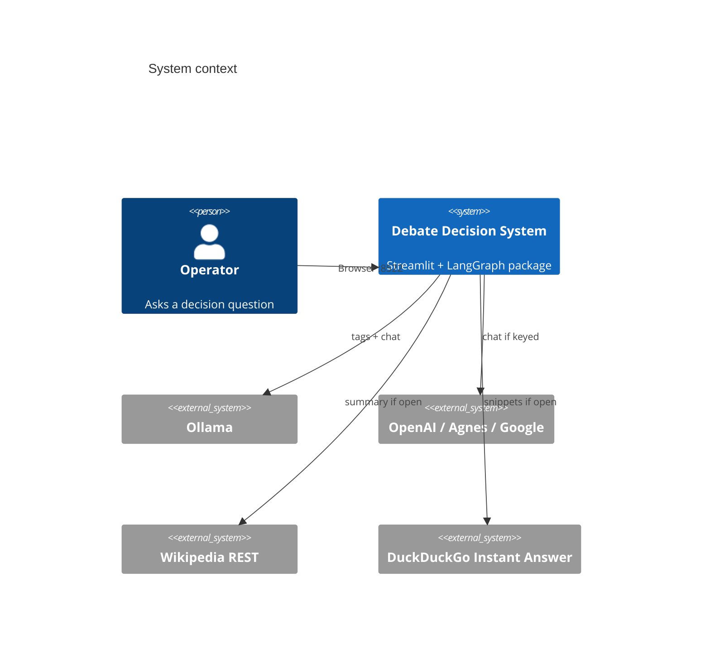
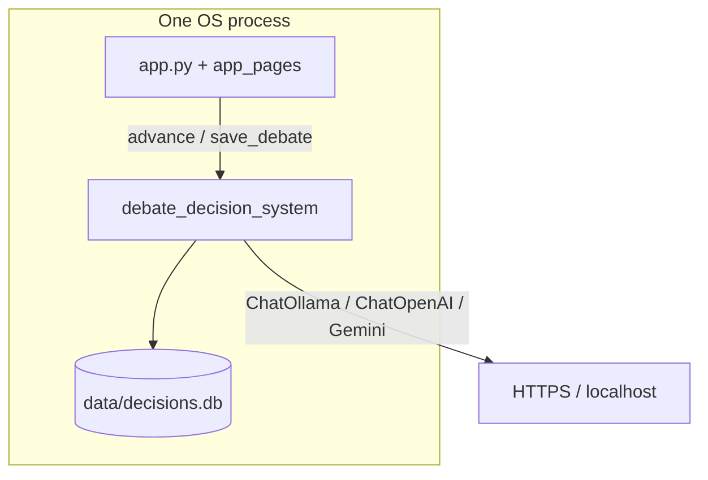
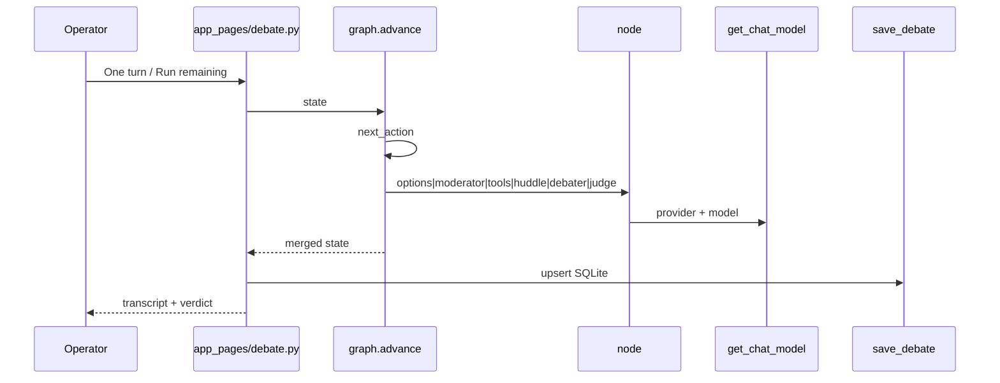
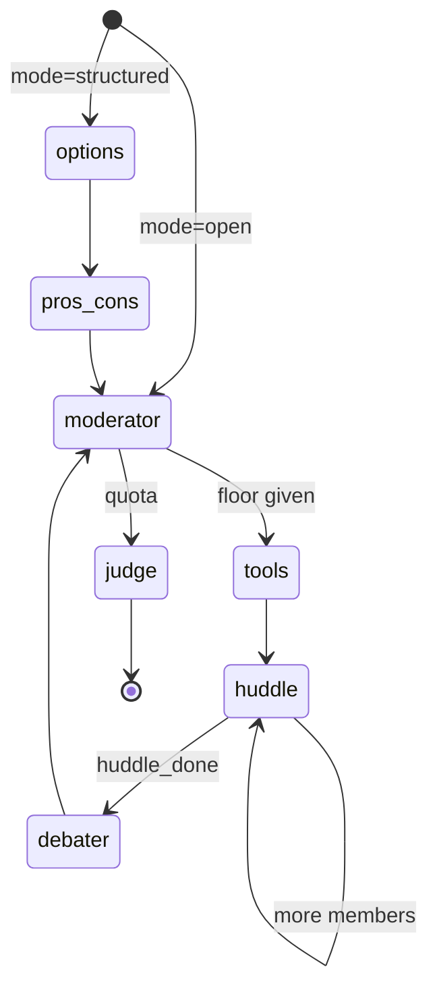

# Architecture — Multi-Agent Debate Decision System

Cited snapshot of the **local checkout**, not GitHub `main` as advertised remotely.

| Field | Value |
| --- | --- |
| Remote | `https://github.com/pypi-ahmad/multi-agent-debate-decision-system.git` |
| Branch | `main` |
| HEAD | `ff1c15f609dd9318dc2dcdf970c396ea4603fe42` (2026-08-16, "Update README and docs for Phase 7") |
| Working tree | Dirty vs HEAD: `memory.py` untracked; `history.py`, `retrieve.py`, `app_pages/debate.py`, `app_pages/history.py`, tests, `README.md`, `AGENTS.md` modified |
| Package | `debate-decision-system` `0.3.0` ([`src/debate_decision_system/__init__.py`](src/debate_decision_system/__init__.py#L8)) |
| License | MIT ([`LICENSE`](LICENSE#L1)) |

This document describes **files on disk now**, including uncommitted memory work.

---

## Part 1 — Whole-repo technical deep-dive

### What this repository is

A Python package and a local Streamlit app that run one bounded multi-agent hearing and persist a structured verdict. README: "Ask a decision question. Seats can be single personas or teams." ([`README.md`](README.md)). Package identity only on the console script; the product is Streamlit on port **8522** ([`docs/technical.md`](docs/technical.md#L11), [`.streamlit/config.toml`](.streamlit/config.toml#L1-L2)).

No auth. No hosted API. No vector index. No CLI that runs a debate ([`docs/technical.md`](docs/technical.md#L90-L92)).

### Tech-stack detection

| Layer | Technology | Evidence |
| --- | --- | --- |
| Language | Python `>=3.11`; pin file `3.13` | [`pyproject.toml`](pyproject.toml#L10), [`.python-version`](.python-version#L1) |
| Package manager | uv + `uv.lock` + `uv_build` | [`pyproject.toml`](pyproject.toml#L36-L38), [`uv.lock`](uv.lock) |
| Graph | LangGraph `StateGraph` | [`src/debate_decision_system/graph.py`](src/debate_decision_system/graph.py#L9-L58) |
| LLM adapters | LangChain Ollama / OpenAI / Google | [`src/debate_decision_system/llm.py`](src/debate_decision_system/llm.py#L11-L13) |
| UI | Streamlit `>=1.61.1`, `st.navigation` | [`pyproject.toml`](pyproject.toml#L26), [`app.py`](app.py#L14-L36) |
| PDF | `pypdf` | [`src/debate_decision_system/documents.py`](src/debate_decision_system/documents.py#L27) |
| Config | `python-dotenv`, OS env wins | [`src/debate_decision_system/config.py`](src/debate_decision_system/config.py#L13-L16) |
| Memory | stdlib `sqlite3` + FTS5 | [`src/debate_decision_system/memory.py`](src/debate_decision_system/memory.py#L18-L19), [`#L333-L392`](src/debate_decision_system/memory.py#L333) |
| Retrieve | Keyword overlap, not embeddings | [`src/debate_decision_system/retrieve.py`](src/debate_decision_system/retrieve.py#L1-L11) |
| Lint / types | Ruff `ALL`, ty 3.11 | [`pyproject.toml`](pyproject.toml#L61-L67), [`#L139-L140`](pyproject.toml#L139) |
| Tests | pytest 9, cov fail-under 80 | [`pyproject.toml`](pyproject.toml#L100-L109) |
| Hooks | prek | [`Makefile`](Makefile#L24-L28), [`.pre-commit-config.yaml`](.pre-commit-config.yaml) |
| Audit | pip-audit | [`Makefile`](Makefile#L18-L19), [`.github/workflows/ci.yml`](.github/workflows/ci.yml#L40-L41) |

### Entry points

| Surface | Path | What it does |
| --- | --- | --- |
| Streamlit app | [`app.py`](app.py) | `st.navigation` → Debate / Decision history / Analytics ([`app.py#L14-L36`](app.py#L14)) |
| Pages | [`app_pages/`](app_pages/) | Scripts, not `pages/` v1 |
| Console | `debate-decision-system` → `debate_decision_system:main` | Prints `debate-decision-system 0.3.0` only ([`pyproject.toml#L29-L30`](pyproject.toml#L29), [`__init__.py#L15-L17`](src/debate_decision_system/__init__.py#L15)) |
| Module | `python -m debate_decision_system` | Same `main()` ([`__main__.py#L4-L7`](src/debate_decision_system/__main__.py#L4)) |
| Windows launcher | [`run.cmd`](run.cmd) | Native Windows. Project-root `.venv` via `uv venv`; `uv sync`; activate; `streamlit run app.py` |
| Linux launcher | [`run.sh`](run.sh) | Native Linux. Same `.venv` flow; official `uv/install.sh` if uv missing |
| Compiled graph | `debate_graph = build_graph()` | Exists ([`graph.py#L61`](src/debate_decision_system/graph.py#L61)). Live UI path is `advance()`, not `debate_graph.invoke` ([`graph.py#L240-L256`](src/debate_decision_system/graph.py#L240)). |

### Commands & Verification Inventory

Verified against [`Makefile`](Makefile), [`pyproject.toml`](pyproject.toml), [`.github/workflows/ci.yml`](.github/workflows/ci.yml). Ran this session (no Streamlit launch).

| Command | Purpose | Evidence |
| --- | --- | --- |
| `uv sync --all-groups` / `make dev` | Install lockfile + lint/test/audit groups | [`Makefile#L3-L4`](Makefile#L3) |
| `uv sync --all-groups --frozen` | CI install, no resolve | [`ci.yml#L25-L26`](.github/workflows/ci.yml#L25) |
| `run.cmd` / `./run.sh` | Serve UI from repo-root `.venv`, port 8522 | [`run.cmd`](run.cmd), [`run.sh`](run.sh), [`.streamlit/config.toml#L2`](.streamlit/config.toml#L2) |
| `uv run debate-decision-system` | Print identity | [`pyproject.toml#L29-L30`](pyproject.toml#L29) |
| `uv run pytest` / `make test` | Full suite + coverage | [`Makefile#L15-L16`](Makefile#L15) |
| `uv run pytest tests/test_analytics.py` | One file | README + pytest `testpaths` |
| `uv run pytest tests/test_debate.py::test_version_is_semver` | One test by name `[UNVERIFIED]` as a documented example; pytest node-id form is standard. Actual one-file run not re-executed this pass. | pytest default |
| `uv run ruff check` / `make lint` | Lint | [`Makefile#L6-L9`](Makefile#L6) |
| `uv run ruff format --check` | Format gate | [`Makefile#L7`](Makefile#L7) |
| `uv run ruff format .` / `make format` | Write format | [`Makefile#L11-L13`](Makefile#L11) |
| `uv run ty check src/` | Types | [`Makefile#L9`](Makefile#L9) |
| `uv run pip-audit .` / `make audit` | CVE scan | [`Makefile#L18-L19`](Makefile#L18) |
| `uv build` / `make build` | sdist + wheel | [`Makefile#L21-L22`](Makefile#L21) |
| `prek run --all-files` / `make hooks` | Local hooks | [`Makefile#L24-L25`](Makefile#L24) |
| Live LLM e2e | **None** | [`README.md`](README.md) Development section |

**Observed this session:** `uv sync --frozen` ok; ruff check/format pass; ty pass; **33** pytest tests pass; coverage **82.07%** (floor 80); pip-audit clean. Streamlit process **not** started (session rule).

**CI enforcement** (required status check / branch protection): `[UNVERIFIED]` — cannot read GitHub branch-protection from disk.

### Directory layout

| Path | Purpose |
| --- | --- |
| `app.py` | Multipage entry |
| `app_pages/` | Debate, history, analytics UI |
| `src/debate_decision_system/` | Package: graph, agents, tools, memory |
| `src/debate_decision_system/agents/` | options, pros/cons, moderator, huddle, debater, judge |
| `tests/` | 6 modules, 33 tests |
| `data/` | `decisions.db` + leftover `debates/*.json` (gitignored) |
| `docs/` | how-to + technical |
| `.github/workflows/` | One workflow: `ci.yml` |
| `.streamlit/` | Port 8522 |
| `dist/` | Built 0.3.0 artifacts (present on disk) |

### Deployment & Runtime Surface

| Pin | Value | Evidence |
| --- | --- | --- |
| Local Python | `.python-version` = `3.13` | [`.python-version`](.python-version#L1) |
| Package floor | `requires-python = ">=3.11"` | [`pyproject.toml#L10`](pyproject.toml#L10) |
| ty check version | `3.11` | [`pyproject.toml#L139-L140`](pyproject.toml#L139) |
| CI OS | `ubuntu-latest` | [`ci.yml#L13`](.github/workflows/ci.yml#L13) |
| CI uv | `astral-sh/setup-uv@20cfd1bf…` v10.0.1 | [`ci.yml#L21-L22`](.github/workflows/ci.yml#L21) |
| App port | `8522` | [`.streamlit/config.toml#L2`](.streamlit/config.toml#L2) |
| SQLite file | `data/decisions.db` | [`memory.py#L18`](src/debate_decision_system/memory.py#L18) |
| Dockerfile / compose / lambda | **None on disk** | listing |
| Drift | Build/check targets 3.11; local pin 3.13; CI uses runner default Python via uv. `[INFERRED]` uv selects from `.python-version` when present in CI checkout. | |

### EOL / dead-dependency scan

| Item | Status |
| --- | --- |
| Python 3.11–3.13 | Supported, not EOL |
| Streamlit `>=1.61.1` | Current major; `st.navigation` in use |
| LangGraph / LangChain 1.x | Active; no dead-stack signal on disk |
| ty `>=0.0.72` | Pre-1.0 API risk `[INFERRED]` |
| DuckDuckGo Instant Answer + Wikipedia REST | Third-party; can vanish `[INFERRED]` |
| Legacy `data/debates/*.json` | Compatibility ingest only ([`memory.py#L159-L163`](src/debate_decision_system/memory.py#L159)) |

No `requirements.txt`, `setup.py`, black, mypy, or Poetry.

### Data / storage

- **SQLite** `decisions` + `decision_links` + optional `decisions_fts` FTS5 ([`memory.py#L330-L392`](src/debate_decision_system/memory.py#L330)).
- Full `state_json` upsert so a hearing can resume ([`memory.py#L2`](src/debate_decision_system/memory.py#L2), [`#L143`](src/debate_decision_system/memory.py#L143)).
- Additive `ALTER TABLE` for `_NEW_COLUMNS` ([`memory.py#L62-L71`](src/debate_decision_system/memory.py#L62), [`#L370-L374`](src/debate_decision_system/memory.py#L370)).
- Legacy JSON under `data/debates/<id>.json` ingested on `load_debate` miss ([`memory.py#L159-L163`](src/debate_decision_system/memory.py#L159)).

### APIs

No first-party HTTP API. Outbound:

| Call | Where |
| --- | --- |
| Ollama `GET {base}/api/tags` | [`config.py#L74-L91`](src/debate_decision_system/config.py#L74) |
| Chat completions | LangChain clients in [`llm.py`](src/debate_decision_system/llm.py) |
| Wikipedia REST summary | [`tools.py#L65-L73`](src/debate_decision_system/tools.py#L65) |
| DuckDuckGo Instant Answer JSON | [`tools.py#L76-L89`](src/debate_decision_system/tools.py#L76) |

### Plugins / jobs

None. No workers, no queues.

### CI/CD

One workflow [`.github/workflows/ci.yml`](.github/workflows/ci.yml): `push` to `main` + all PRs. Jobs: `quality` (frozen sync, ruff, format, ty, pytest xml, pip-audit) and `hooks` (`prek-action`). Permissions `contents: read`. Dependabot weekly + 7-day cooldown ([`.github/dependabot.yml`](.github/dependabot.yml)).

### Testing

6 files, **33** `test_*` functions. Fake chat clients / monkeypatch; no live LLM. Coverage source `src/debate_decision_system`, fail-under 80 ([`pyproject.toml#L107-L121`](pyproject.toml#L107)). Session result: 82.07%.

---

## Part 2 — Context & ecosystem

### Agent / contributor docs on disk

| File | Rules |
| --- | --- |
| [`AGENTS.md`](AGENTS.md) | Caveman tone; never launch Streamlit / frontend |
| [`.github/copilot-instructions.md`](.github/copilot-instructions.md) | Same caveman block |
| [`README.md`](README.md) | User + dev entry |
| [`docs/how-to-use.md`](docs/how-to-use.md) | Recipes |
| [`docs/technical.md`](docs/technical.md) | Informal internals |

No `CONTRIBUTING.md`, no `CODEOWNERS`, no `.github/copilot/` blueprint folder.

### Developer gotchas

- Console script does **not** start Streamlit ([`__init__.py#L15-L17`](src/debate_decision_system/__init__.py#L15)).
- UI must call `advance()`, not compiled `debate_graph` ([`graph.py#L61`](src/debate_decision_system/graph.py#L61) vs [`#L240`](src/debate_decision_system/graph.py#L240)). `[INFERRED]` compiled graph is unused by the app.
- `local_only` rewrites every seat/member to Ollama ([`graph.py#L97-L102`](src/debate_decision_system/graph.py#L97)).
- Grounded mode blocks wikipedia + web_search ([`tools.py#L22-L52`](src/debate_decision_system/tools.py#L22)).
- Code tool is `ast` eval, not `exec` ([`tools.py#L60-L62`](src/debate_decision_system/tools.py#L60)).
- Hidden `st.tabs` / expanders still run Python unless gated. `[INFERRED]` from Streamlit model; not audited page-by-page this pass.
- `data/decisions.db` gitignored ([`.gitignore`](.gitignore)).
- `prek` + detect-secrets baseline required for hooks CI.

### Ecosystem as visible from disk

Single deployable: local Streamlit + local SQLite. Optional daemons: Ollama, hosted LLM HTTPS. No sibling services in-repo.

---

## Part 3 — Architectural blueprint

### Pattern

**Modular local monolith.** Presentation (`app.py` / `app_pages/`) → orchestration (`graph.advance`) → nodes (`agents/`, `tools.py`) → I/O (`llm.py`, `memory.py`, `documents.py`). UI never constructs a provider client.

### C4 — Level 1 system context

### C4 — Level 2 containers

### C4 — Level 3 one step

### Layering

| May import | Must not |
| --- | --- |
| `app_pages` → package public functions | package → Streamlit |
| `graph` → agents, tools, teams, state, config | agents → Streamlit |
| `memory` → sqlite3, state, config | memory → LLM |
| `tools` → retrieve, llm (for planning) | tools → unrestricted exec |

**Enforced by:** convention + ruff; no import-linter / layers plugin on disk.

### Cross-cutting concerns

| Concern | Location | Evidence |
| --- | --- | --- |
| Auth | None | [`docs/technical.md#L9`](docs/technical.md#L9) |
| Config | env + dotenv | [`config.py#L15-L16`](src/debate_decision_system/config.py#L15) |
| Secrets | `.env` gitignored; `.env.example` listed | [`.gitignore`](.gitignore), [`.env.example`](.env.example) |
| Logging | None dedicated; errors on `state["errors"]` | [`state.py#L94`](src/debate_decision_system/state.py#L94) |
| Metrics / tracing | None | — |
| Feature flags | None | — |
| LLM errors | catch → fallback text + `errors` | [`moderator.py#L85-L91`](src/debate_decision_system/agents/moderator.py#L85), [`judge.py#L62-L84`](src/debate_decision_system/agents/judge.py#L62) |
| Timeouts | 120s Ollama, 90s hosted | [`config.py#L48-L49`](src/debate_decision_system/config.py#L48) |

### Inferred ADRs

1. **Stepwise `advance()` over one-shot graph invoke** — UI can pause, inject, huddle one member per rerun ([`graph.py#L214-L256`](src/debate_decision_system/graph.py#L214)).
2. **SQLite file, not a server** — local-first, no auth ([`memory.py#L18`](src/debate_decision_system/memory.py#L18)).
3. **Keyword retrieve, not vectors** — stated in module docstring ([`retrieve.py#L1-L2`](src/debate_decision_system/retrieve.py#L1)).
4. **Restricted AST math, not sandbox VM** — ([`tools.py#L55-L62`](src/debate_decision_system/tools.py#L55)).
5. **Structured judge output via Pydantic** — ([`judge.py#L21-L36`](src/debate_decision_system/agents/judge.py#L21)).
6. **history.py is a re-export shim** — ([`history.py`](src/debate_decision_system/history.py)).

### Governance

CI gates listed above. Ruff `select = ["ALL"]`. Coverage 80%. prek: ruff, trailing whitespace, shellcheck, detect-secrets, actionlint, zizmor. No CODEOWNERS. Branch-protection `[UNVERIFIED]`.

### How to add a feature

1. Domain logic in `src/debate_decision_system/` (new node or function).
2. If it is a graph phase: add to `next_action` / `advance` **and** `build_graph` if the compiled graph should stay in sync (`[INFERRED]` compiled graph may stay stale).
3. Persist via `save_debate` if state grows; add column in `_NEW_COLUMNS` + `_migrate`.
4. UI: edit the matching `app_pages/*.py` script. Do not wrap the page in a function ([Streamlit pages-as-scripts]).
5. Test with a fake LLM in `tests/`. Keep coverage ≥ 80%.
6. `make lint test`. Do not launch Streamlit from agent sessions.

**Pitfalls:** calling `debate_graph.invoke` from UI (loses step control); putting provider calls in `app_pages`; using `exec`; committing `data/decisions.db` or `.env`.

---

## Subsystem deep-dives

### 1. Stepper: `next_action` / `advance`

Live path is a hand-written dispatcher, not LangGraph streaming.

`next_action` ([`graph.py#L214-L237`](src/debate_decision_system/graph.py#L214)):

1. `end` if verdict or last turn is judge.
2. `options` / `pros_cons` / `judge` from `phase`.
3. Else if should-judge, empty transcript, or last role in `{debater, human}` → `moderator`.
4. If `awaiting_speech` or last role in `{tool, huddle}` → `huddle` (team, not done) else `debater`.
5. If last role is `moderator` and name is `Analyst` → `moderator`; else `tools`.

`advance` applies the matching node through `apply_update`, which **appends** `transcript` and `errors` ([`graph.py#L196-L256`](src/debate_decision_system/graph.py#L196)).

Compiled `StateGraph` ([`graph.py#L41-L58`](src/debate_decision_system/graph.py#L41)): START → options|moderator → … → tools → huddle → debater → moderator → judge → END. Same nodes, different control (no pause).

Quota: `should_judge` when `speeches_done >= max_rounds * len(debaters)` ([`moderator.py#L11-L16`](src/debate_decision_system/agents/moderator.py#L11)).

Human inject appends `role=human` and does not increment `speeches_done` ([`graph.py#L289-L296`](src/debate_decision_system/graph.py#L289)). Evidence request plants a moderator turn and retargets `next_speaker` ([`graph.py#L259-L286`](src/debate_decision_system/graph.py#L259)).

### 2. Memory + retrieve

`save_debate` upserts one row keyed by `debate_id`, keeps original `created_at`, writes `state_json` ([`memory.py#L74-L149`](src/debate_decision_system/memory.py#L74)). `load_debate` prefers SQLite, else legacy JSON ([`#L152-L165`](src/debate_decision_system/memory.py#L152)).

Search: SQL + FTS5 virtual table ([`#L381-L392`](src/debate_decision_system/memory.py#L381)). Links are undirected pairs ([`#L358-L362`](src/debate_decision_system/memory.py#L358)).

`retrieve` scores term counts (`len(part) > 2`) over uploaded docs, returns `[name] snippet` ([`retrieve.py#L10-L33`](src/debate_decision_system/retrieve.py#L10)). `knowledge_block` also injects `relevant_decisions` as "Related past decisions" ([`retrieve.py#L36-L73`](src/debate_decision_system/retrieve.py#L36)).

Docs load: text suffixes, PDF via pypdf, zip ≤ 20 files, 20k char cap ([`documents.py#L12-L53`](src/debate_decision_system/documents.py#L12)).

### 3. Teams + tools + judge

Five templates ([`teams.py#L11-L17`](src/debate_decision_system/teams.py#L11)). Non-leaders huddle one step each ([`huddle.py#L12-L19`](src/debate_decision_system/agents/huddle.py#L12)). Public voice is the leader under the **team name** ([`teams.py#L52-L66`](src/debate_decision_system/teams.py#L52)).

Tools: planner may emit ≤ 2 calls ([`tools.py#L113`](src/debate_decision_system/tools.py#L113)). Grounded allow-list `{calculator, code, docs}` ([`#L22-L52`](src/debate_decision_system/tools.py#L22)).

Judge: `with_structured_output(JudgeOutput)`; failure → Split / confidence 0 ([`judge.py#L38-L84`](src/debate_decision_system/agents/judge.py#L38)). Outcomes `clear_winner` | `consensus` | `split` ([`state.py#L14`](src/debate_decision_system/state.py#L14)).

Ten personas ([`personas.py`](src/debate_decision_system/personas.py) `name=` × 10). Bounds: 2–8 seats, 1–6 rounds, 2–4 team members, temp 0.0–1.2 ([`config.py#L34-L46`](src/debate_decision_system/config.py#L34)).

Analytics: Jaccard-style overlap flag ≥ 0.55 ([`analytics.py#L16`](src/debate_decision_system/analytics.py#L16), [`#L36-L48`](src/debate_decision_system/analytics.py#L36)). Simulation uses `reset_for_rerun` + `run_until_done` (limit 80) ([`#L110-L153`](src/debate_decision_system/analytics.py#L110)).

---

## Confidence assessment

| Area | Rating | Note |
| --- | --- | --- |
| Package, graph stepper, state types | High | Read line-by-line |
| Memory schema / FTS / migrate | High | Read `_init` / `_migrate` |
| UI page internals | Inferred | Sampled `debate.py` save/advance; not every widget |
| Compiled `debate_graph` unused by UI | Inferred | No `debate_graph` import in `app_pages` this pass |
| CI *enforced* | Unverified | GitHub settings not on disk |
| Streamlit boot this snapshot | Unverified | Launch banned this session |
| Coverage 82% / 33 tests | High | Ran this session |
| ty 3.11 vs local 3.13 | High (pin exists) | Drift meaning inferred |

---

## Footnotes — local files

| File | Establishes |
| --- | --- |
| [`README.md`](README.md) | Product sentence, run commands |
| [`docs/technical.md`](docs/technical.md) | Informal layer map, "not here" list |
| [`pyproject.toml`](pyproject.toml) | Deps, scripts, ruff/ty/pytest |
| [`Makefile`](Makefile) | Canonical local commands |
| [`.github/workflows/ci.yml`](.github/workflows/ci.yml) | CI gates |
| [`app.py`](app.py) | Navigation |
| [`graph.py`](src/debate_decision_system/graph.py) | Stepper + compiled graph |
| [`state.py`](src/debate_decision_system/state.py) | TypedDict contracts |
| [`memory.py`](src/debate_decision_system/memory.py) | SQLite + FTS |
| [`llm.py`](src/debate_decision_system/llm.py) | Provider factory |
| [`tools.py`](src/debate_decision_system/tools.py) | Tool allow-list |
| [`retrieve.py`](src/debate_decision_system/retrieve.py) | Keyword RAG |
| [`agents/moderator.py`](src/debate_decision_system/agents/moderator.py) | Quota + speaker order |
| [`agents/judge.py`](src/debate_decision_system/agents/judge.py) | Verdict schema |
| [`agents/huddle.py`](src/debate_decision_system/agents/huddle.py) | Private team turns |
| [`teams.py`](src/debate_decision_system/teams.py) | Templates |
| [`analytics.py`](src/debate_decision_system/analytics.py) | Quality + simulation |
| [`config.py`](src/debate_decision_system/config.py) | Bounds + env |
