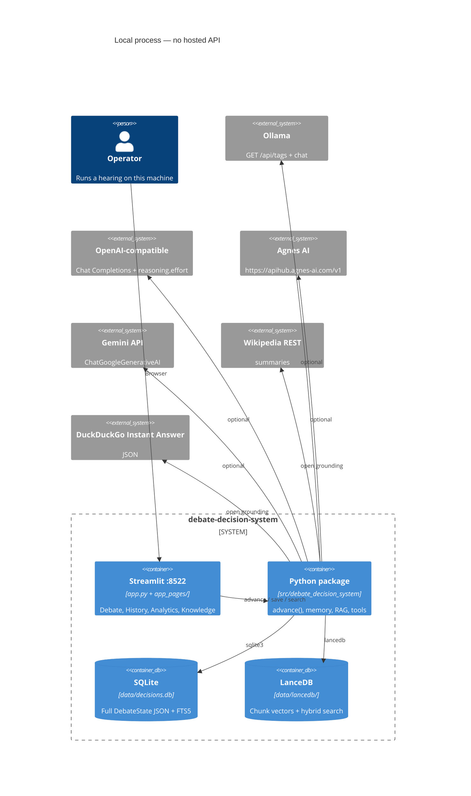
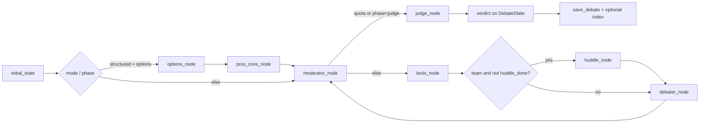

# Project Architecture Blueprint

**Project:** Multi-Agent Debate Decision System (`debate-decision-system` `0.3.0`)
**Generated:** 2026-08-16 from files on disk
**License:** MIT
**Companion maps:** [ARCHITECTURE.md](ARCHITECTURE.md) (earlier checkout snapshot; some claims there are stale), [docs/technical.md](docs/technical.md) (current layer table)

This blueprint is a consistency guide. Prefer this file plus the current source over older architecture notes when they disagree.

---

## 1. Architecture detection and analysis

### 1.1 Detected stack

| Layer | Technology | Evidence |
| --- | --- | --- |
| Language | Python `>=3.11`, pin `3.13` | `pyproject.toml`, `.python-version` |
| Packaging | uv, `uv.lock`, `uv_build` | `pyproject.toml` `[build-system]`, lockfile |
| Product UI | Streamlit `>=1.61.1`, `st.navigation` | `app.py`, `app_pages/` |
| Hearing control | LangGraph `StateGraph` compiled, **stepped by hand** | `graph.py` `build_graph()` vs `advance()` |
| LLM adapters | LangChain `ChatOllama`, `ChatOpenAI`, `ChatGoogleGenerativeAI` | `llm.py` |
| Config | `python-dotenv`, OS env wins (`override=False`) | `config.py` |
| Decision store | stdlib `sqlite3` + FTS5 | `memory.py` → `data/decisions.db` |
| Vector store | LanceDB, hybrid BM25 + dense, RRF | `rag/` → `data/lancedb/` |
| Documents | `pypdf`, zip, plain text | `documents.py` |
| Quality | Ruff ALL, ty 3.11, pytest cov ≥80%, pip-audit, prek | `pyproject.toml`, `Makefile`, `.github/workflows/ci.yml` |

Not present: Docker, compose, WSL requirement, first-party HTTP API, auth, workers, queues, DI container.

### 1.2 Detected pattern

**Single-process layered monolith** with a **TypedDict domain model** and a **manual stepper** that mirrors a LangGraph topology.

Not Clean Architecture (no ports/adapters package). Not microservices. Not event-driven (no bus). Not MVC in the framework sense: Streamlit pages call package functions.

Hybrid traits:

- Graph *shape* is LangGraph (`START → options|moderator → … → judge → END`).
- Live execution is `next_action()` + `advance()` calling node functions. `debate_graph.invoke` is unused by the UI.

---

## 2. Architectural overview

### 2.1 What the system is

A local app: user types a decision question, seats 2–8 personas or teams, optional tools and RAG, a judge writes a structured verdict, SQLite stores the full `DebateState` so a hearing can resume.

Console script `debate-decision-system` only prints the version. The product is Streamlit on port **8522**.

### 2.2 Guiding principles (from the code)

1. **UI never talks to providers.** Pages call `advance` / `save_debate` / RAG helpers.
2. **State is the contract.** `DebateState` is the shared document; nodes return dict patches; `apply_update` merges lists for `transcript` and `errors`.
3. **OS env wins.** Keys are read live from `os.environ`. `.env` fills gaps. `.env.example` is a template.
4. **Local-first.** Default Ollama; `local_only` rewrites every seat to Ollama. Hosted models are opt-in and locked to official slugs.
5. **Grounding is a mode, not a plugin.** `open` vs `grounded` changes the allowed tool set.
6. **Tests isolate LanceDB.** `conftest.py` forces hashed embeddings and a temp store.

### 2.3 Boundaries

| Boundary | How it is enforced |
| --- | --- |
| UI vs package | Pages import `debate_decision_system.*`. Package does not import Streamlit. |
| Provider vs hearing | `get_chat_model(provider, model, temperature)` is the only factory. |
| Memory vs history API | `memory.py` owns SQLite; `history.py` re-exports for old import paths. |
| RAG vs keyword | `knowledge_block` uses RAG unless `rag_enabled` is false, then `retrieve()`. |
| Grounded tools | `allowed_tools(grounding)` drops wikipedia/web in `grounded`. |
| Model catalogs | `OPENAI_MODELS`, `AGNES_MODEL`, `GOOGLE_MODELS`; Ollama from `GET /api/tags`. |

There is no runtime linter for import direction. Consistency is convention + review + tests.

---

## 3. Architecture visualization

### 3.1 C4-style container view (actual deploy)



### 3.2 Component dependencies (downward)

```mermaid
flowchart TB
    subgraph ui [UI]
        app[app.py]
        debate[app_pages/debate.py]
        hist[app_pages/history.py]
        anal[app_pages/analytics.py]
        know[app_pages/knowledge.py]
    end
    subgraph hearing [Hearing]
        graph[graph.py]
        agents[agents/*]
        tools[tools.py]
        teams[teams.py]
        personas[personas.py]
    end
    subgraph knowledge [Knowledge]
        retrieve[retrieve.py]
        rag[rag/*]
        docs[documents.py]
    end
    subgraph persist [Persist]
        memory[memory.py]
        history[history.py]
        analytics[analytics.py]
    end
    llm[llm.py]
    cfg[config.py]
    state[state.py]

    app --> debate
    app --> hist
    app --> anal
    app --> know
    debate --> graph
    debate --> memory
    debate --> rag
    hist --> history
    anal --> analytics
    know --> rag
    graph --> agents
    graph --> tools
    graph --> teams
    graph --> personas
    agents --> llm
    tools --> llm
    tools --> retrieve
    retrieve --> rag
    retrieve --> memory
    history --> memory
    llm --> cfg
    memory --> cfg
    rag --> cfg
    graph --> state
```

### 3.3 Hearing data flow (live stepper, not `invoke`)



Human inject and `request_evidence` patch state without incrementing `speeches_done` (inject) or by retargeting `next_speaker` (evidence).

---

## 4. Core architectural components

### 4.1 Streamlit workspace (`app.py`, `app_pages/`)

- **Purpose:** Human control surface. Configure seats, step or auto-run, continue saved hearings, inspect analytics, manage knowledge.
- **Structure:** `st.navigation` + `st.Page` scripts (not legacy `pages/`). Session state holds the live `DebateState`.
- **Interactions:** Import package APIs only. Cache Ollama tags with `@st.cache_data`.
- **Evolution:** New screen = new `app_pages/*.py` + one `st.Page` in `app.py`. Do not put provider HTTP in pages.

### 4.2 Hearing kernel (`graph.py`)

- **Purpose:** Own the hearing lifecycle: `initial_state`, `next_action`, `advance`, `inject_human`, `request_evidence`, `debate_done`.
- **Structure:** Node functions live in `agents/` and `tools.py`. `build_graph()` documents the same edges for readers and unused compile.
- **Interactions:** Nodes take `DebateState`, return a patch dict. `apply_update` concatenates `transcript` / `errors`.
- **Evolution:** New phase = new node + branch in `next_action` / `advance` *and* the compiled graph, or the two views drift.

### 4.3 Agents (`agents/`)

| Node | Job |
| --- | --- |
| `options_node` / `pros_cons_node` | Structured mode preamble (Analyst turns) |
| `moderator_node` | Floor, quota, `should_judge` |
| `huddle_node` | Private team members, one per step |
| `debater_node` | Public speech (persona or team leader) |
| `judge_node` | Structured `JudgeOutput` → `verdict` |

- **Interactions:** Each node calls `get_chat_model` with the seat or role’s provider/model.
- **Evolution:** New persona goes in `personas.py`. New node follows the patch-dict contract.

### 4.4 Tools (`tools.py`)

- **Purpose:** Optional grounding before a public speech. At most two planned tools. RAG may append `tool:rag`.
- **Allowed set:** `open` → calculator, code, docs, wikipedia, web_search. `grounded` → calculator, code, docs.
- **Evolution:** Add a function + register in `allowed_tools` / `plan_tools`. Keep code tool AST-restricted.

### 4.5 LLM factory (`llm.py` + `config.py`)

- **Purpose:** Build one `BaseChatModel` per call. Live env reads. Locked hosted slugs.
- **Structure:** `get_chat_model` dispatches to Ollama / OpenAI / Agnes / Google helpers.
- **Evolution:** New provider = catalog in `config.py`, branch in `llm.py`, dropdown in `debate.py`, tests in `test_debate.py`.

### 4.6 Memory (`memory.py`, `history.py`)

- **Purpose:** Persist full `DebateState` JSON, search (FTS5 + LIKE), tags, links, archive, continue.
- **Structure:** stdlib SQL, additive `ALTER TABLE`, legacy JSON ingest from `data/debates/`.
- **Evolution:** New columns go through `_NEW_COLUMNS`. Keep `history.py` re-exports if callers still import it.

### 4.7 RAG (`rag/`)

- **Purpose:** Hybrid retrieve for prompts and citations.
- **Structure:** `embeddings.py` (Ollama or hashed) → `vectorstore.py` (LanceDB) → `retriever.py` (rewrite, BM25, dense, RRF) → `reranker.py` → `pipeline.py` (`context_for_state`, index on save).
- **Citations:** `[source: type:name#chunk]`.
- **Evolution:** New collection or embed backend stays behind `embed_text` / `upsert_chunks`. Tests must keep hashed + temp path.

### 4.8 Analytics (`analytics.py`)

- **Purpose:** Overlap, win rates, quality report, `strength_over_time`, `reset_for_rerun`, `run_until_done`.
- **Boundary:** Reads `DebateState` / saved rows. Does not own UI charts (`app_pages/analytics.py` does).

---

## 5. Layers and dependencies

```
UI (app.py, app_pages)
  → Hearing (graph, agents, tools, teams, personas)
      → LLM factory (llm)
  → Knowledge (retrieve, rag, documents)
  → Persist (memory, history, analytics)
        ↘
     config, state
```

**Rules:**

- `state.py` and `config.py` have no package-cycle imports upward.
- `history.py` must not grow logic; it is a facade.
- Agents must not import Streamlit.
- Do not call providers from `memory.py` or `vectorstore.py`.

**Known tension:** Compiled `debate_graph` vs `advance()` can diverge. Treat `advance()` as source of truth until the UI switches to `invoke`.

**DI:** None. Functions import modules. Tests monkeypatch symbols.

Graphify rebuild (2026-08-16): no import cycles detected.

---

## 6. Data architecture

### 6.1 Domain model (`state.py`)

TypedDicts, not ORM entities:

- `DebateState`: hearing document (topic, seats, transcript, verdict, RAG flags, documents).
- `DebaterSpec` / `TeamMember`: seat vs huddle member.
- `Turn`, with roles moderator, debater, judge, human, tool, huddle.
- `Document`, `Verdict`, `SpeechScore`.
- Literals: `Provider`, `Phase`, `DebateMode`, `Grounding`, `Outcome`, `SpeakingOrder`.

### 6.2 SQLite

- File: `data/decisions.db` (`PROJECT_ROOT / "data" / "decisions.db"`).
- Tables: `decisions` (full `state_json`), `decision_links`, optional `decisions_fts`.
- Access: direct SQL in `memory.py`, not a repository class.
- Resume: `load_debate` reconstitutes `DebateState`.
- Search: FTS5 when available, else LIKE / in-Python ranking.

### 6.3 LanceDB

- Path: `data/lancedb/` (overridden in tests).
- Unit of storage: `Chunk` (text, source metadata, vector).
- Write path: index helpers on save / Knowledge page upload.
- Read path: `context_for_state` → `knowledge_block`.

### 6.4 Validation

- Config clamps: 2–8 seats, 1–6 rounds, 2–4 team members, temperature 0.0–1.2.
- Provider/model checks in `get_chat_model` (`ValueError` / `RuntimeError`).
- Judge output via LangChain structured output (`JudgeOutput`).
- No Pydantic domain model for `DebateState`.

### 6.5 Cache

- Streamlit `@st.cache_data` for Ollama model lists (30s).
- RAG embed hashed fallback is deterministic, not a cache.
- No Redis / HTTP cache.

---

## 7. Cross-cutting concerns

### 7.1 Authentication and authorization

**None.** Single-user local process. Anyone who can reach `localhost:8522` can run hearings and read `data/`. Do not add a public bind without an auth design.

### 7.2 Error handling and resilience

- Node failures append to `state["errors"]` (string list merge).
- Timeouts: 120s Ollama, 90s hosted (`config.py`).
- Ollama tag fetch: 2s, empty list on failure.
- RAG: hashed embeddings if Ollama embed is down.
- Gemini 3.7: omit `temperature` (`GOOGLE_NO_SAMPLING`).
- No circuit breaker, no retry wrapper around chat calls.

### 7.3 Logging and monitoring

- No structured logger in the package.
- Streamlit UI surfaces `errors` and transcript.
- Analytics is post-hoc on saved states, not live telemetry.

### 7.4 Validation

- UI sliders/selects encode bounds.
- `initial_state` clamps speaker count and speaking order.
- Grounded mode: if docs exist and speech has no `[`, one cite retry.

### 7.5 Configuration and secrets

| Source | Role |
| --- | --- |
| User/process env | Wins (`OPENAI_API_KEY`, `OPENAI_BASE_URL`, `AGNES_API_KEY`, `GOOGLE_API_KEY`, `OLLAMA_BASE_URL`) |
| `.env` | Fill-ins via `load_dotenv(..., override=False)` |
| `.env.example` | Empty template, committed |
| `.streamlit/config.toml` | Port 8522 |
| `local_only` | Runtime flag, not env |

Never commit `.env`, `data/decisions.db`, or `data/lancedb/`.

---

## 8. Service communication

This is not a service mesh.

| Direction | Protocol | Sync? | Notes |
| --- | --- | --- | --- |
| Browser → Streamlit | HTTP | Sync | Local 8522 |
| Package → Ollama | HTTP `/api/tags`, LangChain chat | Sync | Default `http://localhost:11434` |
| Package → OpenAI / Agnes | Chat Completions | Sync | Agnes base `https://apihub.agnes-ai.com/v1` |
| Package → Gemini | Google GenAI | Sync | `GOOGLE_API_KEY` |
| Package → Wikipedia / DDG | HTTPS JSON | Sync | Open grounding only |
| Package → SQLite / LanceDB | In-process | Sync | Files under `data/` |

No API versioning, discovery, or async jobs. Hearing steps are sequential so the UI can inject humans.

---

## 9. Python / Streamlit / LangChain patterns

### 9.1 Python

- `src/` layout, first-party name `debate_decision_system`.
- `from __future__ import annotations` required (Ruff isort).
- Mix of functions + TypedDicts + a few dataclasses (`RagHit`). Almost no class hierarchies.
- Sync I/O throughout. No asyncio hearing loop.

### 9.2 Streamlit

- Multipage v2: `st.navigation` / `st.Page`.
- Session state for the live hearing.
- `width="stretch"` (not deprecated `use_container_width`).
- Material icons. Sentence case labels.

### 9.3 LangChain / LangGraph

- Chat models constructed per node invocation (not long-lived clients).
- Structured judge output.
- Graph compiled for documentation / possible future `invoke`; production path is the stepper.

---

## 10. Implementation patterns

### 10.1 Interfaces

No abstract base classes for providers. Dispatch is string `provider` + factory. Extension = new branch, not a plugin registry.

### 10.2 Node template

```python
def some_node(state: DebateState) -> dict[str, Any]:
    model = get_chat_model(...)
    # ...
    return {"transcript": [turn], "phase": "..."}
```

Patches, not full-state returns. List keys must be *new items only* so `apply_update` can append.

### 10.3 Memory access

Direct SQL + `_connect()` context manager. Callers use `save_debate` / `load_debate` / `search_decisions`. Do not open `decisions.db` from pages.

### 10.4 UI “controller”

Page scripts: widgets → build/update `DebateState` → `advance` in a loop → `_sync` session → persist.

### 10.5 Domain rules

- `speeches_done` vs `max_rounds * seats` → judge.
- Team seats speak once publicly after huddle members finish.
- `awaiting_speech` set by tools so the next step is huddle/debater, not another moderator.

---

## 11. Testing architecture

| Kind | Where | Pattern |
| --- | --- | --- |
| Unit | `tests/test_debate.py`, `test_tools.py`, `test_rag.py`, `test_memory.py`, `test_analytics.py`, `test_teams.py`, `test_package.py` | Fake chat objects, monkeypatch env and `get_chat_model` |
| Isolation | `tests/conftest.py` | Hash embed + temp LanceDB for every test |
| Coverage | pytest-cov, fail-under 80, `src/debate_decision_system` | CI + local `make test` |
| Live LLM | **None** | Do not add unpaid e2e that needs keys |

Markers exist (`slow`, `integration`) but the suite is mostly fast fakes.

**Blind spot:** Streamlit pages are not e2e-tested (and this repo forbids launching Streamlit in agent sessions).

---

## 12. Deployment architecture

**Topology:** one OS user, one repo checkout, one `.venv` at repo root.

| OS | Launch |
| --- | --- |
| Native Windows | `run.cmd` — install uv if needed, `uv venv .venv`, `uv sync`, activate, `streamlit run app.py` |
| Native Linux | `./run.sh` — same with official `install.sh` |
| Dev extras | `uv sync --all-groups` / `make dev` |
| CI | `ubuntu-latest`, `uv sync --all-groups --frozen`, no app start |

`UV_PROJECT_ENVIRONMENT` is set to the repo-root `.venv` in launchers.

No containers, no cloud binding, no multi-instance locking on SQLite. Do not run two writers against the same `data/decisions.db` without a locking design.

Python drift: package `requires-python >=3.11`, ty checks 3.11, local pin 3.13. uv in CI follows `.python-version` when present.

---

## 13. Extension and evolution

### 13.1 Add a hearing feature

1. Extend `DebateState` if needed (`state.py`).
2. Implement node or helper in `agents/` / `tools.py` / `rag/`.
3. Wire `next_action` + `advance` (and `build_graph` if you keep them aligned).
4. Surface controls in `app_pages/debate.py` only if the human must set them.
5. Persist via existing `state_json` unless you need a new SQL column.
6. Test with a fake LLM; isolate RAG.

### 13.2 Add a provider or model

- Official slug only. Put it in `config.py` catalogs.
- Factory in `llm.py`.
- Dropdown via `models_for_provider`.
- Document env in `.env.example` (empty values).

### 13.3 Integrate an external system

Put HTTP behind `tools.py` or a small module imported by tools. Do not fetch from Streamlit widgets. Respect `grounded` if the call is “open web.”

### 13.4 Compatibility

- `history.py` re-exports: keep until all callers import `memory`.
- Legacy `data/debates/*.json` ingest stays until you drop it explicitly.
- Additive SQLite columns only.

---

## 14. Pattern examples (from source)

### 14.1 Stepper instead of `invoke`

```python
def advance(state: DebateState) -> DebateState:
    action = next_action(state)
    if action == "moderator":
        return apply_update(state, moderator_node(state))
    # ... tools, huddle, debater, judge
    return state
```

UI loops `advance` so it can pause for humans.

### 14.2 Provider factory

```python
def get_chat_model(provider: str, model: str, temperature: float = 0.4) -> BaseChatModel:
    if provider == "OpenAI":
        return _openai_chat(model, temperature)
    if provider == "Agnes AI":
        return _agnes_chat(temperature)
    # ...
```

Agnes ignores the dropdown string and uses `AGNES_MODEL`. Google 3.7 omits sampling params.

### 14.3 Knowledge facade

```python
def knowledge_block(state: DebateState) -> str:
    # RAG via context_for_state unless rag_enabled is false
    # then keyword retrieve() + relevant_decisions()
```

### 14.4 Test isolation

```python
@pytest.fixture(autouse=True)
def isolate_rag_store(tmp_path, monkeypatch) -> None:
    monkeypatch.setattr("debate_decision_system.config.RAG_EMBED_BACKEND", "hash")
    monkeypatch.setattr("debate_decision_system.rag.vectorstore.STORE_PATH", tmp_path / "lancedb")
```

---

## 15. Architectural decision records (inferred from code)

### ADR-1: Stepper over `graph.invoke`

- **Context:** Streamlit needs per-step UI (inject, evidence, auto-run toggle).
- **Decision:** Compile a LangGraph for structure; execute node functions via `advance()`.
- **Consequences:** Fine-grained control. Risk of graph/stepper drift.

### ADR-2: Full state in SQLite

- **Context:** Continue / re-run / analytics need the whole hearing.
- **Decision:** Store `state_json`, not only a verdict row.
- **Consequences:** Simple resume. Schema evolution is additive JSON + optional columns.

### ADR-3: LanceDB beside SQLite

- **Context:** Keyword `retrieve` is weak for long docs.
- **Decision:** Local LanceDB + hybrid RRF; hashed embed when Ollama embed is absent.
- **Consequences:** Offline RAG. Tests must isolate the store.

### ADR-4: Locked hosted models + live OS env

- **Context:** Avoid guessed slugs; this machine already has user env keys.
- **Decision:** Official IDs (`gpt-5.6-luna` medium, `agnes-2.5-flash`, Gemini 3.5-lite / 3.7). Read keys at call time.
- **Consequences:** Predictable dropdowns. New models need a code change.

### ADR-5: No first-party API / no Docker

- **Context:** Single-operator research tool.
- **Decision:** Native `run.cmd` / `run.sh` + Streamlit only.
- **Consequences:** Easy clone-and-run. Unsuitable as a multi-tenant service without a new architecture.

### ADR-6: Grounded vs open tools

- **Context:** Some hearings must stay on uploaded docs.
- **Decision:** `grounding` literal gates wikipedia/web.
- **Consequences:** Clear policy. Easy to get wrong if a new tool is added only to `open`.

---

## 16. Architecture governance

| Mechanism | What it checks |
| --- | --- |
| Ruff ALL | Style, unused, some complexity |
| ty | Types on `src/` (3.11) |
| pytest + cov 80% | Package behavior, not UI |
| pip-audit | Dependency CVEs |
| prek | Local + CI hooks job |
| CI `quality` + `hooks` | `push`/`pull_request` on `main` |
| PR template | Human checklist |

No import-linter / ArchUnit equivalent. Layer rules are social.

Docs to keep aligned: this blueprint, `docs/technical.md`, README provider table. `ARCHITECTURE.md` is a dated snapshot; refresh it or treat it as historical.

---

## 17. Blueprint for new development

### 17.1 Starting points

| Feature type | Start here |
| --- | --- |
| New speech behavior | `agents/` + `graph.py` stepper |
| New tool | `tools.py` + `allowed_tools` |
| New persist field | `state.py` then `memory.py` if queryable |
| New retrieve behavior | `rag/` then `retrieve.knowledge_block` |
| New screen | `app_pages/` + `app.py` |
| New provider | `config.py` + `llm.py` + debate dropdown + tests |

Sequence: state (if needed) → package function → stepper/UI → test with fakes → docs.

### 17.2 File layout for a new node

```
src/debate_decision_system/agents/my_node.py   # my_node(state) -> dict
src/debate_decision_system/graph.py            # next_action + advance + build_graph
tests/test_debate.py                           # fake LLM
```

### 17.3 Pitfalls

- Calling `debate_graph.invoke` from the UI (breaks inject).
- Returning a full transcript from a node (duplicates after `apply_update`).
- Writing keys into committed `.env.example`.
- Hitting real LanceDB from tests (always hash + tmp_path).
- Adding wikipedia to grounded mode by accident.
- Importing Streamlit in the package.
- Launching Streamlit from an agent session (repo rule).
- Assuming `ARCHITECTURE.md` HEAD/test counts are current.

### 17.4 Keeping this blueprint current

Regenerate or edit when you change: stepper vs invoke, storage engines, provider set, page list, or launchers. Date the top of the file. If graphify is rebuilt, reconcile god-nodes (`DebateState`, `initial_state`, `get_chat_model`) with this map.

---

*End of blueprint. Implementation-ready for this monolith; not a template for a hosted multi-tenant service.*
