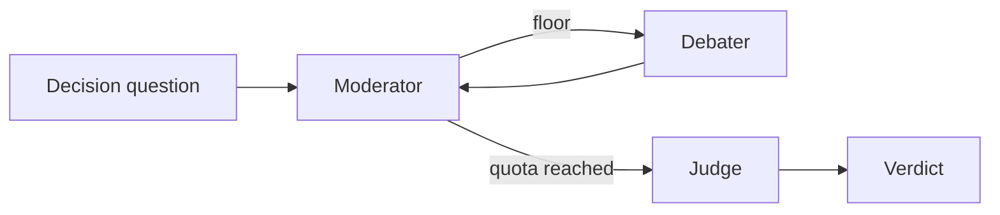

<div align="center">

# Multi-Agent Debate Decision System

*Structured multi-agent debate that produces a decision, not just a conversation.*

[](https://github.com/pypi-ahmad/multi-agent-debate-decision-system/actions)
[](https://www.python.org/downloads/)
[](https://docs.astral.sh/uv/)
[](https://docs.astral.sh/ruff/)
[](LICENSE)

[Features](#features) • [Getting started](#getting-started) • [Usage](#usage) • [Development](#development)

</div>

Ask a decision question. A moderator runs a bounded hearing between opposing personas. A judge returns a winner (or a split), a recommendation you can act on, and the full transcript.

The installable package is `debate-decision-system`. The runner is the Streamlit app in [`app.py`](app.py).

> [!TIP]
> Start with [Ollama](https://ollama.com/) if you want a local run with no API keys.

## Features

- **A verdict, not a chat log** — winner, recommendation, and rationale
- **Bounded hearing** — 2–6 debaters, 1–4 rounds; each persona speaks once per round
- **Fixed personas** — Pragmatist, Skeptic, First-principles, Devil's advocate, Ethicist, Operator
- **Four providers** — Ollama (local tags), OpenAI, Agnes AI, Google Gemini
- **Live transcript** — Streamlit streams each LangGraph turn as it lands
- **Failed turns stay in the room** — a bad LLM call is recorded as a warning; the hearing continues



## Getting started

### Prerequisites

- [uv](https://docs.astral.sh/uv/) 0.11+
- Python 3.11+ (uv will install a matching interpreter if needed)
- Either a local [Ollama](https://ollama.com/) model, or an API key in `.env`

### Install

```bash
uv sync --all-groups
```

This creates `.venv`, installs the package in editable mode, and pulls the `dev` group.

```bash
cp .env.example .env   # Windows: copy .env.example .env
```

Fill keys only for the providers you will use. Ollama needs none.

### Run

```bash
# Windows: installs uv if missing, syncs deps, copies .env if absent
run.cmd

# Any platform
uv run streamlit run app.py
```

Open [http://localhost:8522](http://localhost:8522), pick a provider and model, set debaters and rounds, enter a question, start the debate.

> [!NOTE]
> The console script only prints the package identity. It does not start a debate.
>
> ```bash
> uv run debate-decision-system
> # debate-decision-system 0.1.0
> ```

## Usage

| Provider | Models | Required env |
| --- | --- | --- |
| Ollama | whatever is pulled on the daemon | `OLLAMA_BASE_URL` (default `http://localhost:11434`) |
| OpenAI | `gpt-5.6-luna`, `gpt-5.6-terra` | `OPENAI_API_KEY` |
| Agnes AI | `agnes-2.5-flash` | `AGNES_API_KEY` |
| Google | `gemini-3.5-flash-lite`, `gemini-3.7-flash` | `GOOGLE_API_KEY` |

See [`.env.example`](.env.example) for base URLs. Bounds live in `src/debate_decision_system/config.py`: 2–6 debaters, 1–4 rounds.

Add runtime dependencies with `uv add <package>`. Do not edit the dependency list in `pyproject.toml` by hand.

## Project structure

```text
.
├── app.py                          # Streamlit runner (port 8522)
├── run.cmd                         # Windows launch helper
├── src/debate_decision_system/
│   ├── config.py                   # providers, keys, debate bounds
│   ├── llm.py                      # chat model factory
│   ├── state.py                    # DebateState / Turn / Verdict
│   ├── personas.py                 # six fixed personas
│   ├── graph.py                    # LangGraph: moderator ⇄ debater → judge
│   └── agents/                     # moderator, debater, judge nodes
├── tests/                          # pytest, no live LLM
├── .github/workflows/ci.yml
├── pyproject.toml
└── Makefile
```

## Development

```bash
make dev        # uv sync --all-groups
make format     # ruff format + autofix
make lint       # format check, ruff, ty
make test       # pytest (fails under 80% coverage)
make audit      # pip-audit
make build      # sdist + wheel
```

CI on `push` to `main` and on every PR: frozen `uv sync`, Ruff, ty, pytest, pip-audit.

```bash
uv tool install prek && prek install
prek run --all-files
```
