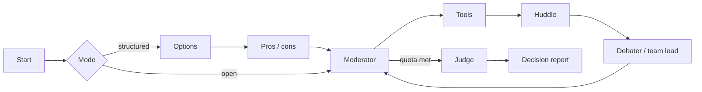

<div align="center">

# Multi-Agent Debate Decision System

*Structured multi-agent debate that produces a decision, not just a conversation.*

[](https://github.com/pypi-ahmad/multi-agent-debate-decision-system/actions)
[](https://www.python.org/downloads/)
[](https://docs.astral.sh/uv/)
[](https://docs.astral.sh/ruff/)
[](LICENSE)

**GitHub:** <https://github.com/pypi-ahmad/multi-agent-debate-decision-system>

</div>

You type a decision question. The system seats AI personas or **teams**, a moderator gives the floor, optional tools and LanceDB RAG can ground speeches in your documents, and a judge returns a structured verdict: outcome (`clear_winner` / `consensus` / `split`), a concrete recommendation, a confidence score (0–100), key risks, and per-speech scores across clarity, logic, evidence, and persuasiveness.

Everything runs on **your** machine. Streamlit UI on port **8522**, four pages (Debate, Decision history, Analytics, Knowledge), local SQLite + LanceDB, no hosted service, no auth. Package `debate-decision-system` `0.3.0`, Python 3.11+.

```bash
git clone https://github.com/pypi-ahmad/multi-agent-debate-decision-system.git
```

## Table of Contents

- [Welcome](#welcome)
- [Disclaimer](#disclaimer)
- [Features](#features)
- [Getting started](#getting-started)
- [Usage](#usage)
- [Architecture](#architecture)
- [Documentation](#documentation)
- [Contributing](#contributing)
- [Development](#development)

## Welcome

This project is **free**, MIT-licensed, and community-driven. Clone it, run it, file bugs, suggest features, or send pull requests.

You run everything on your machine, using your own Ollama models or API keys. Your data never leaves your machine unless you choose a hosted provider.

**Please do not send money.** Donations and sponsorship are not needed or wanted. A useful issue or a well-tested PR is more than enough.

How-to and help: [docs/how-to-use.md](docs/how-to-use.md) · [SUPPORT.md](SUPPORT.md)

## Disclaimer

> [!CAUTION]
> **All data processed by this app is 100% your responsibility**: questions, uploaded documents, `data/decisions.db`, `data/lancedb/`, and anything sent to Ollama, OpenAI, Agnes AI, Google, Wikipedia, or DuckDuckGo.

Software is provided **as is**, without warranty. Outputs are not professional advice. Do not expose port **8522** to a network. Full text: [DISCLAIMER.md](DISCLAIMER.md).

## Features

**Debate engine**
- Open mode: moderator gives the floor directly after startup
- Structured mode: options enumeration → pros/cons analysis → hearing → judgment
- Hearing advances one node at a time via `advance()`: pause, inject a human note, or ask for evidence at any point

**Seats and personas**
- 2–8 seats, 1–6 rounds, temperature 0.0–1.2, speaking order sequential/reverse/random
- 10 built-in personas: Pragmatist, Skeptic, First-principles, Devil's advocate, Ethicist, Operator, Optimistic, Data-driven, Risk-averse, Creative
- Team seats: up to 4 members huddle privately before the leader speaks publicly
- 5 team templates: Engineering, Product, Business, Security, Devil's Advocate
- Per-seat provider and model override

**Tools and grounding**
- Open mode: calculator, code (restricted math), docs, Wikipedia, DuckDuckGo web search
- Grounded mode: calculator, code, docs only. Speeches must cite `[source: …]`
- LanceDB hybrid RAG: dense + BM25, RRF fusion, rerank, sentence compression, per-chunk citations
- RAG embed backends: `auto` (Ollama nomic-embed-text → bge-small → hash fallback) or `hash`

**Decision report**
- Outcome: `clear_winner`, `consensus`, or `split`
- Per-seat recommendation, confidence score, strongest arguments, key risks
- Per-speech scores: clarity, logic, evidence, persuasiveness
- Markdown export and Mermaid phase timeline

**Memory and history**
- SQLite `data/decisions.db`: upsert on `debate_id`, full state JSON, FTS5 search
- Tags, categories, notes, archive/unarchive, undirected decision links
- Continue any past debate from its saved state
- Past decided debates auto-indexed into LanceDB longterm collection

**Analytics**
- Win rates, participation balance, circular-speech flags (Jaccard ≥ 0.55), strength over time
- Quality report per debate: participation, overlap flags, mean score axes, summary paragraph
- Simulation: run debates headlessly for batch analysis

## Getting started

**Prerequisites:** [uv](https://docs.astral.sh/uv/) 0.11+, Python 3.11–3.13, and either [Ollama](https://ollama.com/) or an API key.

Native Windows (cmd or Explorer, **not** WSL or Docker) or native Linux.

```bash
git clone https://github.com/pypi-ahmad/multi-agent-debate-decision-system.git
cd multi-agent-debate-decision-system
```

| OS | First run |
| --- | --- |
| Windows | Double-click `run.cmd` |
| Linux | `chmod +x run.sh && ./run.sh` |

Open [http://localhost:8522](http://localhost:8522).

The launcher installs uv if needed, creates `.venv` at the repo root, syncs the lockfile, copies `.env.example` → `.env` when missing, makes `data/` directories, and starts Streamlit.

### Zero-key first debate (Ollama)

```bash
ollama pull llama3.1:8b        # any local chat model works
# optional: ollama pull nomic-embed-text   # for semantic RAG
```

1. Start the app → **Fully local** on → pick the model
2. Mode `open`, 2 seats, 1 round
3. Enter a question → **Start debate** → **Step** or **Run**

> [!IMPORTANT]
> An empty model dropdown means Ollama is not running or is not at `OLLAMA_BASE_URL` (default `http://localhost:11434`).

## Usage

### Providers

| Provider | Models | Env var | Optional base URL |
| --- | --- | --- | --- |
| Ollama | tags from local daemon | — | `OLLAMA_BASE_URL` (default `http://localhost:11434`) |
| OpenAI | `gpt-5.6-luna` (effort medium) | `OPENAI_API_KEY` | `OPENAI_BASE_URL` |
| Agnes AI | `agnes-2.5-flash` | `AGNES_API_KEY` | `AGNES_BASE_URL` |
| Google | `gemini-3.5-flash-lite`, `gemini-3.7-flash` | `GOOGLE_API_KEY` | — |

OS env wins over `.env`.

> [!NOTE]
> `gemini-3.7-flash` does not accept sampling parameters. Temperature is stripped silently. Use `gemini-3.5-flash-lite` if the temperature slider matters.

### Common tasks

| Task | How |
| --- | --- |
| Use a hosted model | Add key to `.env`, toggle **Fully local** off |
| Structured debate | Set **Mode** to `structured` |
| Team seat | Set seat type to **team**, pick a template, optionally mark a leader |
| Grounded mode | Toggle **Grounded** on, upload `.pdf`/`.md`/`.py`/`.txt`/`.zip` |
| Build RAG library | **Knowledge** page → upload → index → search test |
| Pause mid-debate | **Pause** → **Inject** a human note → resume |
| Ask for evidence | Click **Ask for evidence** after a debater speaks |
| Continue a debate | **Decision history** → **Continue debate** |
| Search past debates | **Decision history** → search box + filters (outcome, status, tag, date, confidence) |
| Archive | **Decision history** → **Archive** (hidden, not deleted; restore with **Unarchive**) |
| Export | **Export record** (Markdown) or **Mermaid timeline** (inline diagram) |

Full recipes: [docs/how-to-use.md](docs/how-to-use.md)

## Architecture

`advance()` walks one node at a time. The UI never talks to providers directly.



```text
app.py + app_pages/          Streamlit UI (4 pages)
src/debate_decision_system/  graph, agents, tools, memory, RAG, analytics, export
run.cmd / run.sh             native launchers (Windows / Linux)
data/                        SQLite + LanceDB (gitignored)
```

Internals: [docs/technical.md](docs/technical.md) · [ARCHITECTURE.md](ARCHITECTURE.md) · [Project_Architecture_Blueprint.md](Project_Architecture_Blueprint.md)

## Documentation

All documentation lives in the repository alongside the code.

| File | Contents |
| --- | --- |
| [docs/how-to-use.md](docs/how-to-use.md) | Step-by-step recipes: first debate, hosted models, structured mode, personas, teams, grounded docs, RAG library, pause/inject, evidence, history, export, analytics |
| [docs/technical.md](docs/technical.md) | Internal reference: DebateState fields, graph execution, all agents, tools, personas, teams, RAG pipeline, SQLite schema, analytics functions, export, config constants, quality gates |
| [ARCHITECTURE.md](ARCHITECTURE.md) | Comprehensive cited architecture document with C4 diagrams, ADRs, and subsystem deep-dives |
| [Project_Architecture_Blueprint.md](Project_Architecture_Blueprint.md) | Extended architecture blueprint and design decisions |
| [CONTRIBUTING.md](CONTRIBUTING.md) | Ways to contribute, local setup, quality checks, PR workflow, ground rules |
| [SECURITY.md](SECURITY.md) | Security model, what to report, and how to report privately |
| [SUPPORT.md](SUPPORT.md) | Common stuck points, where to ask questions, community guidelines |
| [DISCLAIMER.md](DISCLAIMER.md) | Data responsibility, no-warranty statement, API key ownership |
| [CHANGELOG.md](CHANGELOG.md) | Version history |

## Contributing

Contributions of any kind are welcome: bug reports, feature ideas, documentation fixes, new personas, test improvements, and code changes.

- Read [CONTRIBUTING.md](CONTRIBUTING.md) for setup, quality checks, and ground rules
- Use the [bug report template](https://github.com/pypi-ahmad/multi-agent-debate-decision-system/issues/new?template=bug_report.md) or [feature request template](https://github.com/pypi-ahmad/multi-agent-debate-decision-system/issues/new?template=feature_request.md)
- Good first contributions: new personas in `personas.py`, doc fixes, additional test coverage, RAG improvements

**No financial support needed or wanted.** The project is free. The author does not accept donations or sponsorship. The best way to support the project is a clear issue or a well-tested PR.

For usage questions: [SUPPORT.md](SUPPORT.md). For data responsibility: [DISCLAIMER.md](DISCLAIMER.md).

## Development

```bash
make dev      # install all dependency groups
make lint     # ruff format --check + ruff check + ty check src/
make test     # pytest (coverage ≥ 80%)
make audit    # pip-audit
```

Add dependencies with `uv add`. Tests use fake chat clients. Do not add live-LLM end-to-end tests. Coverage must stay at or above 80%.

CI runs on every push/PR to `main`: frozen `uv sync`, Ruff, ty, pytest, pip-audit, pre-commit hooks.

---

<p align="center">Made with ❤️ by Ahmad Mujtaba</p>
