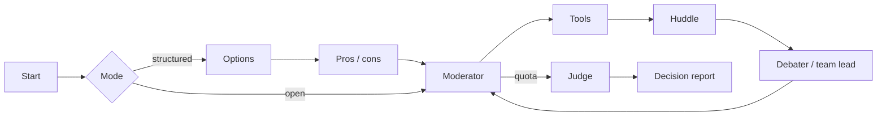

<div align="center">

# Multi-Agent Debate Decision System

*Structured multi-agent debate that produces a decision, not just a conversation.*

[](https://github.com/pypi-ahmad/multi-agent-debate-decision-system/actions)
[](https://www.python.org/downloads/)
[](https://docs.astral.sh/uv/)
[](https://docs.astral.sh/ruff/)
[](LICENSE)

**Repository:** [https://github.com/pypi-ahmad/multi-agent-debate-decision-system](https://github.com/pypi-ahmad/multi-agent-debate-decision-system)

```bash
git clone https://github.com/pypi-ahmad/multi-agent-debate-decision-system.git
```

</div>

## Index

1. [What this is](#what-this-is)
2. [Welcome](#welcome)
3. [Documentation](#documentation)
4. [Features](#features)
5. [Getting started](#getting-started)
6. [Usage](#usage)
7. [Architecture](#architecture)
8. [Development](#development)

## What this is

You type a decision question (ship vs wait, pick a store, change a process). The app seats two or more agents — each a fixed reasoning style, or a **team** that huddles first. A **moderator** gives the floor. Optional **tools** (calculator, restricted math, docs, Wikipedia, web) and **LanceDB RAG** can ground the speeches. A **judge** returns an outcome (`clear_winner` / `consensus` / `split`), a recommendation, a confidence score, risks, and per-speech scores.

The UI is Streamlit on port **8522**: Debate, Decision history, Analytics, Knowledge. The package name is `debate-decision-system` `0.3.0`. Persistence is local SQLite (`data/decisions.db`) plus LanceDB (`data/lancedb/`). There is no hosted API and no auth.

The console script only prints the package identity. It does not start a debate.

```bash
uv run debate-decision-system
# debate-decision-system 0.3.0
```

> [!TIP]
> Start with [Ollama](https://ollama.com/) and turn on **Fully local** if you want a run with no API keys.

> [!NOTE]
> The hearing is stepped by `advance()`, one node at a time, so you can pause, inject a human note, or ask for evidence. The UI never constructs a provider client.

## Welcome

This project is **free**, MIT-licensed, and community-driven. Clone it from [github.com/pypi-ahmad/multi-agent-debate-decision-system](https://github.com/pypi-ahmad/multi-agent-debate-decision-system), run it, break it, file bugs, suggest features, send PRs. You are welcome here.

**You run everything on your machine.** Bring your own Ollama models or your own API keys. Nothing is hosted for you. **All data you type, upload, or send to a model is 100% your responsibility.** Read [DISCLAIMER.md](DISCLAIMER.md).

**Please do not send money.** No donations, sponsorship, or paid support are needed or wanted.

| You want to… | Go here |
| --- | --- |
| Ask how to use it | [SUPPORT.md](SUPPORT.md) |
| Report a bug | [Bug report](.github/ISSUE_TEMPLATE/bug_report.md) |
| Suggest a feature | [Feature request](.github/ISSUE_TEMPLATE/feature_request.md) |
| Contribute code | [CONTRIBUTING.md](CONTRIBUTING.md) |
| Report a vulnerability | [SECURITY.md](SECURITY.md) |

## Documentation

| Doc | What it is |
| --- | --- |
| [docs/how-to-use.md](docs/how-to-use.md) | Recipes: first debate, hosted models, teams, grounding, RAG library, history, analytics |
| [docs/technical.md](docs/technical.md) | Layers, providers, graph, tools, RAG, memory, analytics, quality gates |
| [ARCHITECTURE.md](ARCHITECTURE.md) | Cited onboarding map of the checkout (stack, commands, C4, subsystems) |
| [MODERNIZATION_PLAN.md](MODERNIZATION_PLAN.md) | Leave-in-place plan; residual hardening only |
| [AGENTS.md](AGENTS.md) | Agent tone and the no-Streamlit-launch rule |
| [.github/copilot-instructions.md](.github/copilot-instructions.md) | Copilot auto-load (same caveman block) |
| [.github/copilot-instructions.modernization.md](.github/copilot-instructions.modernization.md) | Commands and phase gates for the modernization plan |
| [LICENSE](LICENSE) | MIT |
| [DISCLAIMER.md](DISCLAIMER.md) | You own the data, the keys, and the risk; no donations |
| [CONTRIBUTING.md](CONTRIBUTING.md) | How to set up, test, and open a PR |
| [SUPPORT.md](SUPPORT.md) | Usage help and common stuck points |
| [SECURITY.md](SECURITY.md) | Private vulnerability reports |
| [.github/ISSUE_TEMPLATE/bug_report.md](.github/ISSUE_TEMPLATE/bug_report.md) | Bug template |
| [.github/ISSUE_TEMPLATE/feature_request.md](.github/ISSUE_TEMPLATE/feature_request.md) | Feature template |
| [.github/PULL_REQUEST_TEMPLATE.md](.github/PULL_REQUEST_TEMPLATE.md) | PR checklist |
| [pyproject.toml](pyproject.toml) | Package metadata, deps, Ruff / ty / pytest |
| [.env.example](.env.example) | Env template for API keys and RAG embed settings |

There is no `.github/copilot/` blueprint folder.

## Features

- **Four pages** — Debate, Decision history, Analytics, Knowledge
- **Decision report** — outcome, winner, recommendation, confidence, risks, argument scores
- **Open or structured** — structured mode is options → pros/cons → debate → judge
- **Teams** — Engineering, Product, Business, Security, Devil's Advocate; huddle then leader speaks
- **Tools** — calculator, restricted math code, docs search; Wikipedia and DuckDuckGo in **open** knowledge mode
- **Grounded mode** — documents + calculator/code only; speeches must cite `[source:…]`
- **RAG** — LanceDB hybrid retrieve (dense + BM25), rerank, compression, citations; session vs long-term
- **Memory** — every step writes SQLite; search, link, continue, export
- **Analytics** — win rates, circular-speech flags, quality report, strength over time, multi-model simulation

## Getting started

### Prerequisites

- [uv](https://docs.astral.sh/uv/) 0.11+
- Python 3.11+ (`.python-version` is `3.13`)
- A local [Ollama](https://ollama.com/) model, or an API key in `.env`

### Install and run

```bash
git clone https://github.com/pypi-ahmad/multi-agent-debate-decision-system.git
cd multi-agent-debate-decision-system
uv sync --all-groups
copy .env.example .env   # Unix: cp .env.example .env
run.cmd                  # Windows
uv run streamlit run app.py
```

Open [http://localhost:8522](http://localhost:8522).

`run.cmd` installs uv if missing, syncs the lockfile, copies `.env` when needed, creates `data/debates` and `data/lancedb`, and starts Streamlit.

### First debate (Ollama)

1. `ollama pull llama3.1:8b` (or any local chat model)
2. Optional RAG embeddings: `ollama pull nomic-embed-text`
3. Start the app
4. On **Debate**, turn **Fully local** on. Pick the Ollama model
5. Mode `open`. Seats: 2 agents, 1 round
6. Enter a decision question. Click **Start debate**

You should see moderator and speaker turns, then a **Decision report**.

> [!IMPORTANT]
> Empty model list means Ollama is not reachable at `OLLAMA_BASE_URL` (default `http://localhost:11434`).

## Usage

| Provider | Models | Env |
| --- | --- | --- |
| Ollama | tags from the local daemon | `OLLAMA_BASE_URL` (default `http://localhost:11434`) |
| OpenAI | `gpt-5.6-luna` (medium effort) | `OPENAI_API_KEY`, optional `OPENAI_BASE_URL` |
| Agnes AI | `agnes-2.5-flash` | `AGNES_API_KEY` |
| Google | `gemini-3.5-flash-lite`, `gemini-3.7-flash` | `GOOGLE_API_KEY` |

Bounds in `config.py`: 2–8 seats, 1–6 rounds, 2–4 members per team, temperature 0.0–1.2.

| Job | How |
| --- | --- |
| Hosted model | Copy `.env.example` → `.env`, fill one key, turn **Fully local** off |
| Structured decision | Mode `structured` (options → pros/cons → hearing) |
| Team seat | Type `team`, pick a template, mark a Leader |
| Grounded docs | Knowledge `grounded`, upload `.pdf` / `.md` / `.py` / `.txt` / `.zip` |
| Long-term RAG library | **Knowledge** page → index uploads → search test |
| Pause / inject | Pause → **Inject** a note, or **Ask for evidence** |
| Continue a past run | **Decision history** → search → **Continue debate** |

Full recipes: [docs/how-to-use.md](docs/how-to-use.md).

## Architecture

`advance()` walks one node at a time so the UI can pause, inject, and huddle. The UI never talks to providers.



Individuals skip huddle. Teams huddle privately, then the leader speaks in public. `tools` may append `tool:rag` citation turns when RAG is on.

```text
.
├── app.py                         # st.navigation entry
├── app_pages/                     # debate, history, analytics, knowledge
├── run.cmd
├── docs/
├── src/debate_decision_system/
│   ├── graph.py                   # advance / inject / seats
│   ├── agents/                    # options, huddle, moderator, debater, judge
│   ├── tools.py                   # calc, code, wiki, web, docs, RAG turns
│   ├── teams.py                   # team templates
│   ├── memory.py                  # SQLite decisions
│   ├── rag/                       # LanceDB hybrid pipeline
│   ├── analytics.py
│   └── documents.py               # PDF / zip / text loaders
├── tests/
├── data/decisions.db              # local, gitignored
├── data/lancedb/                  # local, gitignored
└── Makefile
```

Internals: [docs/technical.md](docs/technical.md). Cited map: [ARCHITECTURE.md](ARCHITECTURE.md).

## Development

| Layer | Choice |
| --- | --- |
| Language | Python `>=3.11` |
| Package | [uv](https://docs.astral.sh/uv/) + `uv.lock` + `uv_build` |
| Graph | LangGraph + LangChain adapters |
| UI | Streamlit `>=1.61.1` on port **8522** |
| Docs | `pypdf` |
| Memory | SQLite at `data/decisions.db` |
| Vectors | LanceDB at `data/lancedb/` |
| Quality | Ruff, ty, pytest (fail under 80%), pip-audit, prek |

```bash
make dev lint test audit
uv tool install prek && prek install
uv run pytest
```

CI on `push` to `main` and every PR: frozen `uv sync`, Ruff, ty, pytest, pip-audit, prek.

Add runtime deps with `uv add <package>`. Do not edit dependency lists in `pyproject.toml` by hand. Nodes use fake chat clients in tests. There is no live-LLM e2e suite.
