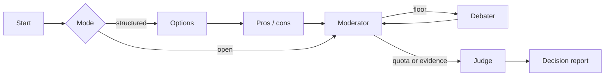

<div align="center">

# Multi-Agent Debate Decision System

*Structured multi-agent debate that produces a decision, not just a conversation.*

[](https://github.com/pypi-ahmad/multi-agent-debate-decision-system/actions)
[](https://www.python.org/downloads/)
[](https://docs.astral.sh/uv/)
[](https://docs.astral.sh/ruff/)
[](LICENSE)

**https://github.com/pypi-ahmad/multi-agent-debate-decision-system**

[How to use](docs/how-to-use.md) • [Technical docs](docs/technical.md)

[Features](#features) • [Getting started](#getting-started) • [Usage](#usage) • [Architecture](#architecture) • [Development](#development)

</div>

Ask a decision question. A moderator runs a bounded hearing between opposing personas. A judge returns an outcome (clear winner, consensus, or split), a recommendation, a confidence score, and a transcript you can export.

The installable package is `debate-decision-system`. The runner is the Streamlit app in [`app.py`](app.py).

> [!TIP]
> Start with [Ollama](https://ollama.com/) and turn on **Fully local** if you want a run with no API keys.

> [!NOTE]
> The console script only prints the package identity. It does not start a debate.
>
> ```bash
> uv run debate-decision-system
> # debate-decision-system 0.1.0
> ```

## Features

- **Decision report** — outcome, winner, recommendation, confidence, strongest arguments, key risks
- **Two modes** — `open` debate, or `structured` (options → pros/cons → debate → judge)
- **10 personas** — Pragmatist, Skeptic, First-principles, Devil's advocate, Ethicist, Operator, Optimistic, Data-driven, Risk-averse, Creative
- **Per-seat models** — each agent can use a different provider/model
- **Live controls** — start, pause, one turn, run remaining, inject a human note, ask for evidence
- **Docs in the room** — upload `.txt` / `.md` / `.csv` / `.json`; agents keyword-search them
- **History** — debates save under `data/debates/` and can be loaded again
- **Compare + export** — side-by-side speeches, 0–10 scores, download `debate.md`

## Technology stack

| Layer | Choice |
| --- | --- |
| Language | Python `>=3.11` (local default `.python-version` is `3.13`) |
| Package | [uv](https://docs.astral.sh/uv/) + `uv.lock` + `uv_build` |
| Graph | LangGraph (`langgraph>=1.2.11`) |
| LLM | LangChain adapters for Ollama, OpenAI, Agnes AI, Google |
| UI | Streamlit `>=1.61.1` on port **8522** |
| Quality | Ruff, ty, pytest (fail under 80%), pip-audit, prek hooks |

No database. History is JSON files. Keyword retrieve, not a vector store.

## Architecture

`advance()` walks one node at a time so the UI can pause and inject. The compiled `debate_graph` is the same shape.



Seats, temperature, speaking order, and uploaded docs live on `DebateState` in `src/debate_decision_system/state.py`.

## Getting started

### Prerequisites

- [uv](https://docs.astral.sh/uv/) 0.11+
- Python 3.11+
- Either a local [Ollama](https://ollama.com/) model, or an API key in `.env`

### Install and run

```bash
uv sync --all-groups
copy .env.example .env   # Unix: cp .env.example .env
run.cmd                  # Windows: uv + sync + .env + Streamlit
# Any platform:
uv run streamlit run app.py
```

Open [http://localhost:8522](http://localhost:8522).

`run.cmd` installs uv if missing, runs `uv sync`, copies `.env.example` when needed, creates `data/debates`, and starts the app.

## Usage

| Provider | Models | Env |
| --- | --- | --- |
| Ollama | tags from the local daemon | `OLLAMA_BASE_URL` (default `http://localhost:11434`) |
| OpenAI | `gpt-5.6-luna`, `gpt-5.6-terra` (medium effort) | `OPENAI_API_KEY`, optional `OPENAI_BASE_URL` |
| Agnes AI | `agnes-2.5-flash` | `AGNES_API_KEY`, default base `https://apihub.agnes-ai.com/v1` |
| Google | `gemini-3.5-flash-lite`, `gemini-3.7-flash` | `GOOGLE_API_KEY` |

Bounds in `src/debate_decision_system/config.py`: 2–8 debaters, 1–6 rounds, temperature 0.0–1.2, speaking order sequential / reverse / random.

Add runtime deps with `uv add <package>`. Do not edit the dependency list in `pyproject.toml` by hand.

## Project structure

```text
.
├── app.py                            # Streamlit runner (port 8522)
├── run.cmd                           # Windows one-click launch
├── .env.example
├── src/debate_decision_system/
│   ├── config.py                     # providers, keys, bounds
│   ├── llm.py                        # chat model factory
│   ├── state.py                      # DebateState / Turn / Verdict
│   ├── personas.py                   # ten personas
│   ├── graph.py                      # LangGraph + step/inject/evidence
│   ├── retrieve.py                   # keyword search over uploads
│   ├── history.py                    # JSON save/load
│   ├── export.py                     # markdown + mermaid timeline
│   └── agents/                       # options, pros/cons, moderator, debater, judge
├── tests/
├── data/debates/                     # local history (JSON gitignored)
├── .github/workflows/ci.yml
├── pyproject.toml
└── Makefile
```

## Development

```bash
make dev        # uv sync --all-groups
make format     # ruff format + autofix
make lint       # format check, ruff, ty
make test       # pytest (fails under 80% coverage)
make audit      # pip-audit
make build      # sdist + wheel
```

CI on `push` to `main` and on every PR: frozen `uv sync`, Ruff, ty, pytest, pip-audit, plus a `hooks` job (`prek`).

```bash
uv tool install prek && prek install
prek run --all-files
```

## Testing

```bash
uv run pytest
uv run pytest tests/test_debate.py::test_structured_flow_and_evidence
```

Coverage is collected on `src/debate_decision_system` and **fails under 80%**. Nodes run against fake chat clients. There is no live-LLM or Streamlit e2e suite.
