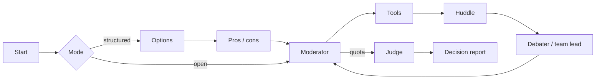

<div align="center">

# Multi-Agent Debate Decision System

*Structured multi-agent debate that produces a decision, not just a conversation.*

[](https://github.com/pypi-ahmad/multi-agent-debate-decision-system/actions)
[](https://www.python.org/downloads/)
[](https://docs.astral.sh/uv/)
[](https://docs.astral.sh/ruff/)
[](LICENSE)

**https://github.com/pypi-ahmad/multi-agent-debate-decision-system**

[How to use](docs/how-to-use.md) • [Technical docs](docs/technical.md)

[Features](#features) • [Getting started](#getting-started) • [Usage](#usage) • [Architecture](#architecture) • [Development](#development)

</div>

Ask a decision question. Seats can be single personas or teams. A moderator runs a bounded hearing. Tools and uploaded docs can ground the speeches. A judge returns an outcome, a recommendation, a confidence score, and a transcript you can store and re-run.

The package is `debate-decision-system`. The app is Streamlit: [`app.py`](app.py) plus [`app_pages/`](app_pages/).

> [!TIP]
> Start with [Ollama](https://ollama.com/) and turn on **Fully local** if you want a run with no API keys.

> [!NOTE]
> The console script only prints the package identity. It does not start a debate.
>
> ```bash
> uv run debate-decision-system
> # debate-decision-system 0.1.0
> ```

## Features

- **Three pages** — Debate, Decision history, Analytics
- **Decision report** — outcome (`clear_winner` / `consensus` / `split`), winner, recommendation, confidence, risks
- **Open or structured** — structured mode is options → pros/cons → debate → judge
- **Teams** — Engineering, Product, Business, Security, Devil's Advocate; huddle then leader speaks
- **Tools** — calculator, restricted math code, docs search; Wikipedia and DuckDuckGo in **open** knowledge mode
- **Grounded mode** — documents + calculator/code only; speeches must cite `[source]`
- **Memory** — every step writes SQLite `data/decisions.db`; search, link, continue, export
- **Analytics** — win rates, circular-speech flags, quality report, multi-model simulation

## Technology stack

| Layer | Choice |
| --- | --- |
| Language | Python `>=3.11` (`.python-version` is `3.13`) |
| Package | [uv](https://docs.astral.sh/uv/) + `uv.lock` + `uv_build` |
| Graph | LangGraph |
| LLM | LangChain adapters: Ollama, OpenAI, Agnes AI, Google |
| UI | Streamlit `>=1.61.1` on port **8522** (`st.navigation`) |
| Docs | `pypdf` for PDF text; keyword retrieve, not a vector store |
| Memory | SQLite (`stdlib`) at `data/decisions.db` |
| Quality | Ruff, ty, pytest (fail under 80%), pip-audit, prek |

## Architecture

`advance()` walks one node at a time so the UI can pause, inject, and huddle.



Individuals skip huddle. Teams huddle privately, then the leader speaks in public.

## Getting started

### Prerequisites

- [uv](https://docs.astral.sh/uv/) 0.11+
- Python 3.11+
- A local [Ollama](https://ollama.com/) model, or an API key in `.env`

### Install and run

```bash
uv sync --all-groups
copy .env.example .env   # Unix: cp .env.example .env
run.cmd                  # Windows
uv run streamlit run app.py
```

Open [http://localhost:8522](http://localhost:8522).

`run.cmd` installs uv if missing, syncs the lockfile, copies `.env` when needed, creates `data/debates`, and starts Streamlit.

## Usage

| Provider | Models | Env |
| --- | --- | --- |
| Ollama | tags from the local daemon | `OLLAMA_BASE_URL` (default `http://localhost:11434`) |
| OpenAI | `gpt-5.6-luna`, `gpt-5.6-terra` (medium effort) | `OPENAI_API_KEY`, optional `OPENAI_BASE_URL` |
| Agnes AI | `agnes-2.5-flash` | `AGNES_API_KEY` |
| Google | `gemini-3.5-flash-lite`, `gemini-3.7-flash` | `GOOGLE_API_KEY` |

Bounds in `config.py`: 2–8 seats, 1–6 rounds, 2–4 members per team, temperature 0.0–1.2.

Add runtime deps with `uv add <package>`. Do not edit dependency lists in `pyproject.toml` by hand.

## Project structure

```text
.
├── app.py                         # st.navigation entry
├── app_pages/debate.py            # hearing UI
├── app_pages/history.py           # search / continue / link / export
├── app_pages/analytics.py         # charts + simulation
├── run.cmd
├── docs/
├── src/debate_decision_system/
│   ├── graph.py                   # advance / inject / seats
│   ├── agents/                    # options, huddle, moderator, debater, judge
│   ├── tools.py                   # calc, code, wiki, web, docs
│   ├── teams.py                   # team templates
│   ├── history.py                 # SQLite
│   ├── analytics.py               # quality + simulate helpers
│   └── documents.py               # PDF / zip / text loaders
├── tests/
├── data/decisions.db              # local, gitignored
└── Makefile
```

## Development

```bash
make dev lint test audit
uv tool install prek && prek install
```

CI on `push` to `main` and every PR: frozen `uv sync`, Ruff, ty, pytest, pip-audit, `prek` hooks.

```bash
uv run pytest
uv run pytest tests/test_analytics.py
```

Coverage is collected on `src/debate_decision_system` and **fails under 80%**. Nodes use fake chat clients. There is no live-LLM e2e suite.
