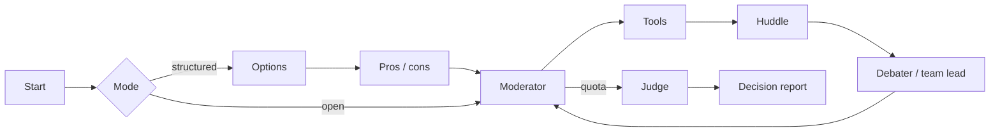

<div align="center">

# Multi-Agent Debate Decision System

*Structured multi-agent debate that produces a decision, not just a conversation.*

[](https://github.com/pypi-ahmad/multi-agent-debate-decision-system/actions)
[](https://www.python.org/downloads/)
[](https://docs.astral.sh/uv/)
[](https://docs.astral.sh/ruff/)
[](LICENSE)

**GitHub:** <https://github.com/pypi-ahmad/multi-agent-debate-decision-system>

[Features](#features) · [Getting started](#getting-started) · [Usage](#usage) · [Documentation](#documentation) · [Contributing](#contributing)

</div>

You type a decision question. The app seats AI personas or **teams**, a **moderator** gives the floor, optional **tools** and **LanceDB RAG** can ground speeches in your documents, and a **judge** returns a structured verdict: outcome (`clear_winner` / `consensus` / `split`), a concrete recommendation, confidence score, key risks, and per-speech scores.

Everything runs on **your** machine — Streamlit UI on port **8522**, four pages (Debate, Decision history, Analytics, Knowledge), local SQLite + LanceDB, no hosted API, no auth. Package `debate-decision-system` `0.3.0`, Python 3.11+.

```bash
git clone https://github.com/pypi-ahmad/multi-agent-debate-decision-system.git
```

> [!TIP]
> Start with [Ollama](https://ollama.com/) and **Fully local** for a zero-API-key run. `ollama pull llama3.1:8b` is enough.

> [!NOTE]
> Hearings advance one node at a time with `advance()`, so you can pause, inject a human note, or request evidence mid-debate. The UI never builds a provider client directly.

## Table of Contents

- [Welcome](#welcome)
- [Disclaimer](#disclaimer)
- [Features](#features)
- [Getting started](#getting-started)
- [Usage](#usage)
- [Architecture](#architecture)
- [Documentation](#documentation)
- [Contributing](#contributing)
- [Development](#development)

## Welcome

This project is **free** and community-driven. Clone it, run it, test it, file bugs, suggest features, send PRs. First-time contributors are welcome.

**You run everything on your machine** with **your** Ollama models or **your** API keys.

**Please do not send money.** Donations and sponsorship are not needed or wanted.

How-to and help: [docs/how-to-use.md](docs/how-to-use.md) · [SUPPORT.md](SUPPORT.md)

## Disclaimer

> [!CAUTION]
> **All data processed by this app is 100% your responsibility** — questions, uploads, `data/decisions.db`, `data/lancedb/`, and anything sent to Ollama, OpenAI, Agnes AI, Google, Wikipedia, or DuckDuckGo.

Software is **as is**. Outputs are not professional advice. Do not expose port **8522**. Full text: [DISCLAIMER.md](DISCLAIMER.md).

## Features

- Four pages: Debate, Decision history, Analytics, Knowledge
- Decision report with outcome, winner, recommendation, confidence, risks, scores
- Open or structured mode (options → pros/cons → hearing → judge)
- Team seats: huddle privately, then the leader speaks
- Tools: calculator, restricted math, docs; Wikipedia and DuckDuckGo in **open** mode
- Grounded mode: documents + calculator/code only; speeches must cite `[source:…]`
- LanceDB hybrid RAG (dense + BM25), rerank, citations
- SQLite memory: search, link, continue, export
- Analytics: win rates, circular-speech flags, quality, strength over time

## Getting started

**Need:** [uv](https://docs.astral.sh/uv/) 0.11+, Python 3.11+ (pin `3.13`), and either [Ollama](https://ollama.com/) or an API key.

Native Windows (cmd / Explorer, not WSL or Docker) or native Linux. Same repo-root `.venv`.

```bash
git clone https://github.com/pypi-ahmad/multi-agent-debate-decision-system.git
cd multi-agent-debate-decision-system
```

| OS | First run |
| --- | --- |
| Windows | Double-click `run.cmd` |
| Linux | `./run.sh` |

Open [http://localhost:8522](http://localhost:8522).

The launcher installs uv if needed, creates `.venv`, syncs the lockfile, copies `.env.example` → `.env` when missing, makes `data/` dirs, then starts Streamlit from the venv.

### First debate (Ollama)

1. `ollama pull llama3.1:8b` (any local chat model works)
2. Optional: `ollama pull nomic-embed-text`
3. Start the app → **Fully local** on → pick the model
4. Mode `open`, 2 seats, 1 round
5. Enter a question → **Start debate**

> [!IMPORTANT]
> Empty model list means Ollama is not at `OLLAMA_BASE_URL` (default `http://localhost:11434`).

## Usage

| Provider | Models | Env |
| --- | --- | --- |
| Ollama | tags from the local daemon | `OLLAMA_BASE_URL` |
| OpenAI | `gpt-5.6-luna` (medium effort) | `OPENAI_API_KEY`, optional `OPENAI_BASE_URL` |
| Agnes AI | `agnes-2.5-flash` | `AGNES_API_KEY` |
| Google | `gemini-3.5-flash-lite`, `gemini-3.7-flash` | `GOOGLE_API_KEY` |

OS env wins over `.env`. Bounds: 2–8 seats, 1–6 rounds, 2–4 team members, temperature 0.0–1.2.

| Job | How |
| --- | --- |
| Hosted model | Fill one key in `.env`, turn **Fully local** off |
| Structured | Mode `structured` |
| Team seat | Type `team`, pick a template, mark a Leader |
| Grounded docs | Knowledge `grounded`, upload `.pdf` / `.md` / `.py` / `.txt` / `.zip` |
| RAG library | **Knowledge** page → index → search test |
| Pause / inject | Pause → **Inject**, or **Ask for evidence** |
| Continue | **Decision history** → **Continue debate** |

More recipes: [docs/how-to-use.md](docs/how-to-use.md).

## Architecture

`advance()` walks one node at a time. The UI never talks to providers.



```text
app.py + app_pages/          Streamlit
src/debate_decision_system/  graph, agents, tools, memory, RAG
run.cmd / run.sh             native launchers
data/                        SQLite + LanceDB (gitignored)
```

Internals: [docs/technical.md](docs/technical.md) · [ARCHITECTURE.md](ARCHITECTURE.md) · [Project_Architecture_Blueprint.md](Project_Architecture_Blueprint.md)

## Documentation

All documentation lives in the repository alongside the code.

| File | Contents |
| --- | --- |
| [docs/how-to-use.md](docs/how-to-use.md) | Recipes: first debate, hosted keys, team seats, grounded docs, RAG library, pause/inject, history, analytics, personas |
| [docs/technical.md](docs/technical.md) | Internals: graph execution, providers, tools, RAG pipeline, memory schema, analytics, export |
| [ARCHITECTURE.md](ARCHITECTURE.md) | Comprehensive cited architecture document with C4 diagrams, ADRs, and subsystem deep-dives |
| [Project_Architecture_Blueprint.md](Project_Architecture_Blueprint.md) | Extended architecture blueprint and design decisions |
| [CONTRIBUTING.md](CONTRIBUTING.md) | How to contribute: setup, checks, PR workflow, ground rules |
| [SECURITY.md](SECURITY.md) | Security model, what to report, and how to report it privately |
| [SUPPORT.md](SUPPORT.md) | Common stuck points, where to ask questions, and community guidelines |
| [DISCLAIMER.md](DISCLAIMER.md) | Data responsibility, no-warranty statement, API key ownership |
| [CHANGELOG.md](CHANGELOG.md) | Version history (if present) |

## Contributing

Contributions of any kind are welcome — bug reports, feature ideas, documentation fixes, new personas, test improvements, and code changes all help.

- Read [CONTRIBUTING.md](CONTRIBUTING.md) for the full workflow, checks, and ground rules.
- Use the [bug report template](https://github.com/pypi-ahmad/multi-agent-debate-decision-system/issues/new?template=bug_report.md) or [feature request template](https://github.com/pypi-ahmad/multi-agent-debate-decision-system/issues/new?template=feature_request.md) on GitHub Issues.
- Good first contributions: new personas (`personas.py`), doc fixes, test coverage, RAG improvements.

**No financial support needed or wanted.** The project is free. The author does not accept donations, sponsorships, or any form of financial contribution. The best way to give back is a useful issue or a well-tested pull request.

For help, see [SUPPORT.md](SUPPORT.md). For data responsibility, see [DISCLAIMER.md](DISCLAIMER.md).

## Development

```bash
make dev lint test audit
uv run pytest
```

CI on `push`/`PR` to `main`: frozen `uv sync`, Ruff, ty, pytest (cov ≥ 80%), pip-audit, prek. Add deps with `uv add`. Tests use fake chat clients.

<p align="center">Made with ❤️ by Ahmad Mujtaba</p>
